# springboot038-基于SpringBoot的网上租赁系统设计与实现

>  博主介绍：
>  Hey，我是程序员Chaers，一个专注于计算机领域的程序员
>  十年大厂程序员全栈开发‍ 日常分享项目经验 解决技术难题与技术推荐 承接各类网站设计，小程序开发，毕设等。
>  【计算机专业课程设计，毕业设计项目，Java，微信小程序，安卓APP都可以做，不仅仅是计算机专业，其它专业都可以】

## 3000套系统可挑选，获取链接：https://chaerspol.github.io/

<b>QQ【获取完整源码】：674456564</b>

<b>QQ群【获取完整源码】：1058861570</b>

### 系统架构

> 前端：html | js | css | jquery | vue
>
> 后端：springboot | mybatis
> 
> 环境：jdk1.8+ | mysql | maven

# 一、内容包括
包括有  项目源码+项目论文+数据库源码+答辩ppt+远程调试成功

# 二、运行环境

> jdk版本：1.8 及以上； ide工具：IDEA； 数据库: mysql5.7及以上；编程语言: Java

# 三、需求分析

**3.1 可行性分析**

在系统开发之初要进行系统可行分析，这样做的目的就是使用最小成本解决最大问题，一旦程序开发满足用户需要，带来的好处也是很多的。下面我们将从技术上、操作上、经济上等方面来考虑这个系统到底值不值得开发。

**3.1.1 技术可行性**

本基于Spring Boot的网上租贸系统采用Java和MYSQL数据库进行开发设计，作为计算机专业学生，在学校期间就接触到许多关于编程方面的知识，当然也包括各种编程软件，对他们的了解度也比较系统，所以技术开发上面还是有一定把握。

**3.1.2 经济可行性**

由于自己本身就是学生，还没有正式参加工作，金钱上面一直都处于缺乏状态。所以在开发程序过程中，我是不会花太多经济成本在上面的。针对开发软件和数据库，还有界面设计的photoshop软件等在百度上面就可以直接下载，然后根据各种安装视频进行安装，这些资源都是免费的，程序编码阶段使用的源代码在百度上面可以轻松获得，在有网络的环境下就能下载下来，不需要支付任何费用，经济成本很低。

**3.1.3 操作可行性**

本人自己就是学生，程序开发经验不足，在界面设计上面不会设计太复杂，要讲究简单好看，操作上要方便，不能让用户觉得不流畅。用户一旦进入操作界面，界面上就会有相应提示，跟着操作提示就可以找到对应的功能操作模块，对于用户来说免培训就能使用。本基于Spring Boot的网上租贸系统本身具有操作可行性，其界面设计清晰、功能权限分配合理，操作简单，不同用户登录后可对进行相应功能模块的操作，具有极高的操作可行性。

**3.1.4 时间可行性**

从时间上看，在三个月的时间里学习相关知识，开发本基于Spring Boot的网上租贸系统，时间上是有点紧，但是不是不可能实现，在做毕业设计的这几个月里，我通过努力使得功能应该基本可以实现。
综上所述，我们进行了四个方面的可行性研究，可以看出，该基于Spring Boot的网上租贸系统的开发是没有问题的。

**3.2 系统功能分析**

本基于Spring Boot的网上租贸系统主要满足三种用户的需求，这三种用户分别为管理员、商家和用户，下面将对这三种用户分别实现的功能进行详细的阐述。

（1）用户：用户在系统前台可查看系统信息，包括首页、商品信息等，注册登录后主要功能模块包括购物车、个人中心、我的地址、订单信息管理、发货订单管理、租借订单管理、完成订单管理以及我的收藏管理，用例图如图所示。
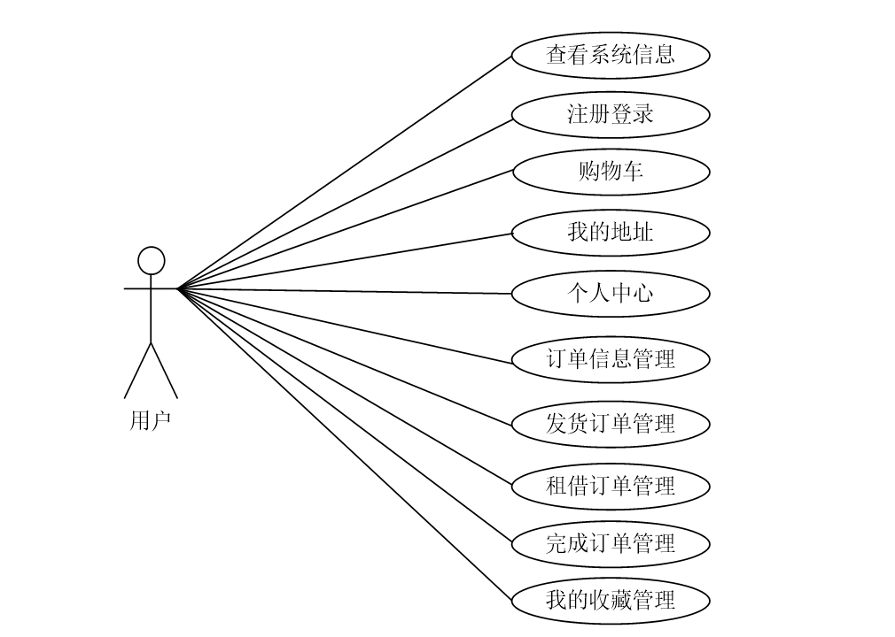

（2）管理员：管理员登录后可对系统进行全面的管理，主要功能模块包括个人中心、用户管理、商家管理、商品信息管理、商品分类管理、订单信息管理、发货订单管理、租借订单管理、完成订单管理、系统管理以及订单管理。管理员用例图如图所示。
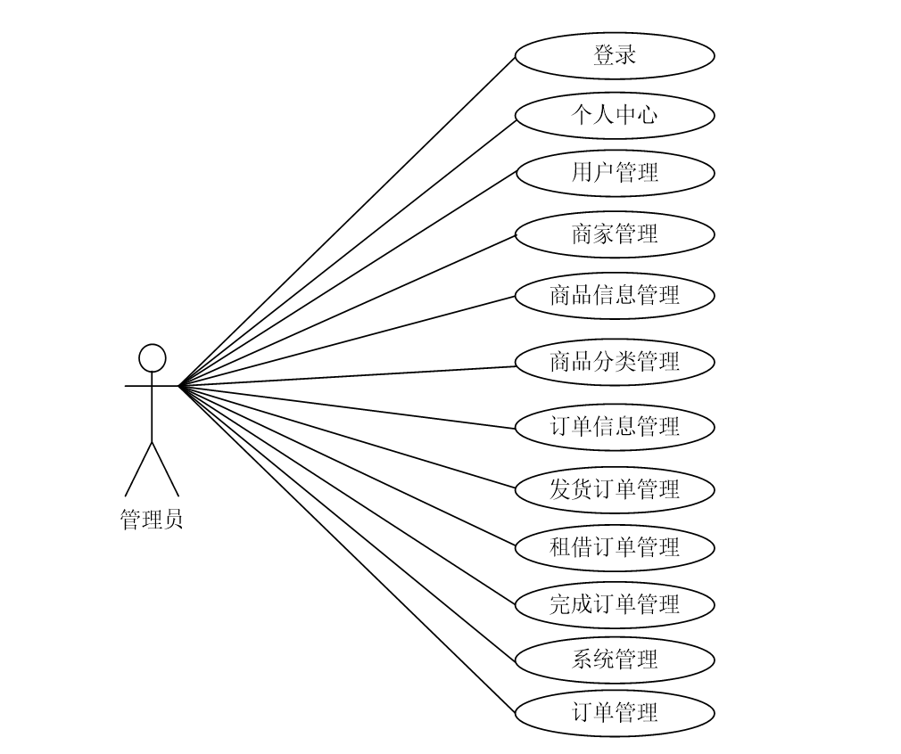

（3）商家：商家注册登录后主要功能模块包括个人中心、商品信息管理、订单信息管理。发货订单管理、租借订单管理、完成订单管理以及订单管理。商家用例图如图所示。

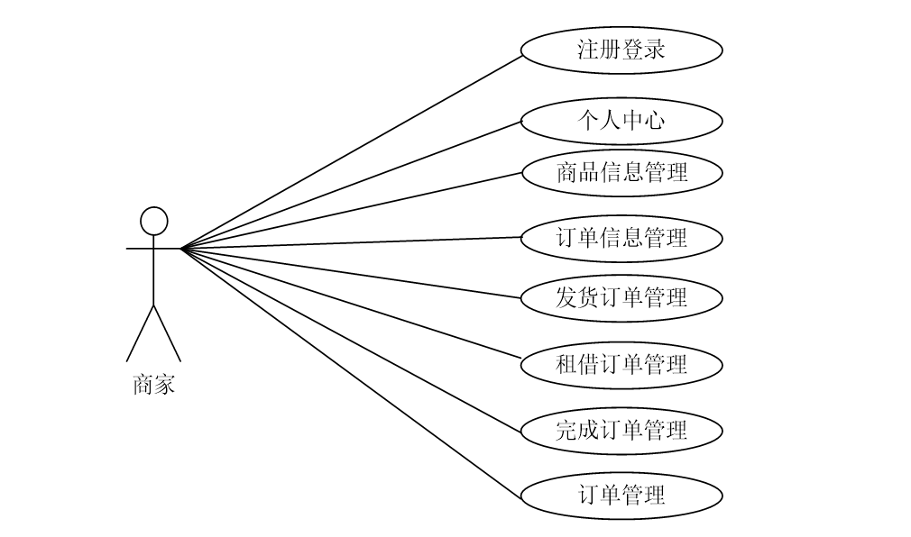

# 四、功能模块

系统结构设计是一个将一个庞大的任务细分为多个小的任务的过程，这些小的任务分段完成后，组合在一起形成一个完整的任务。在整个设计过程，以确定可能的具体方案达成每一个小的最终目标，对于每一个小的目标而言，我们必须先了解一些相关的需求分析的信息。然后对系统进行初步的设计，并对其逐渐进行优化，设计出一个具体可实现的系统结构。本基于Spring Boot的网上租贸系统主要包括用户模块、商家模块和管理员模块，根据系统功能需求分析，可画出本基于Spring Boot的网上租贸系统的结构图如图所示
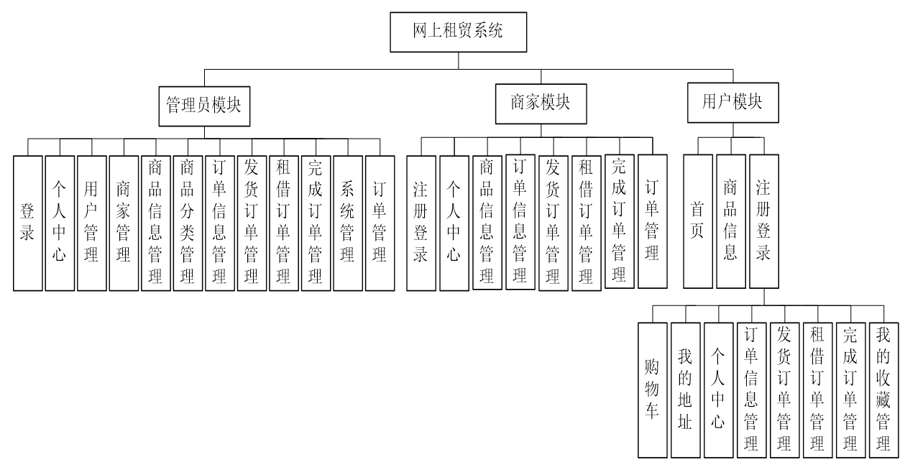

# 五、部分效果图展示

图5-1 用户注册界面【没有账号的用户可进入注册界面进行注册操作，用户注册界面的运行效果如图】

图5-2用户登录界面【用户要想实现商品购买、租赁等操作，必须进行登录操作，在登录界面输入正确的用户名和密码，选择登录类型，点击登录按钮进行登录，用户登录界面如图】
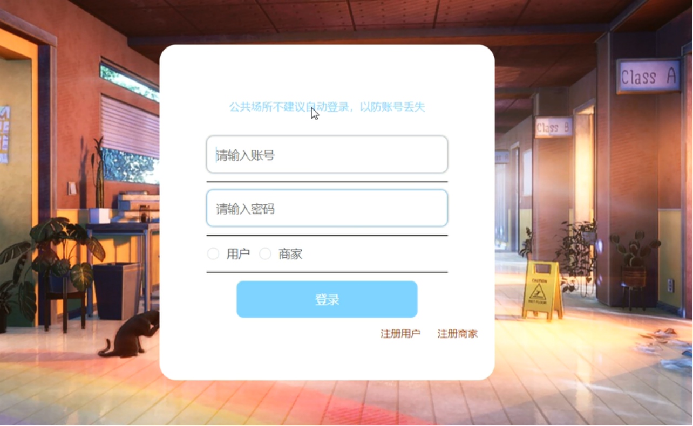

图5-3个人信息界面【用户登录后可对个人信息进行修改，个人信息界面的运行效果如图】
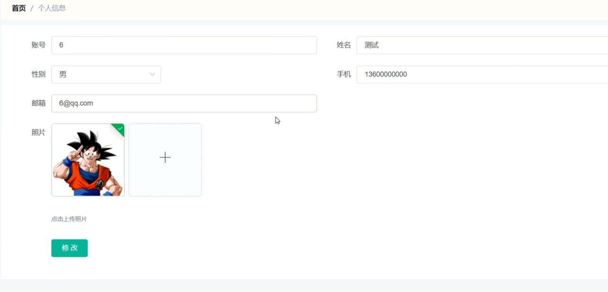

图5-4 商品详情界面【用户可选择商品查看商品详情信息，登录后可进行加入购物车、租赁和购买操作，商品详情界面如图】
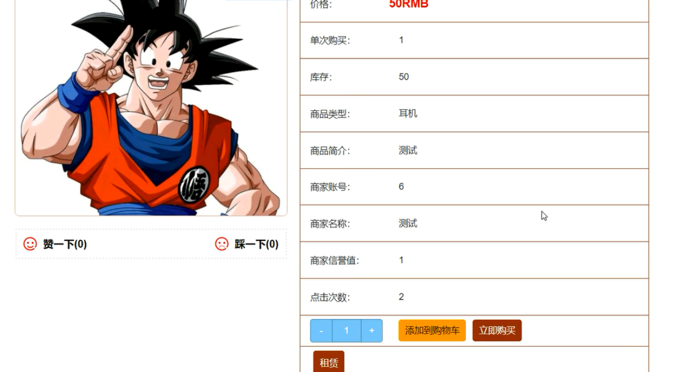 

图5-5 购物车界面【用户在购物车界面可查看购物车商品信息，并可进行修改数量、删除商品以及购买等操作，购物车界面展示如图】
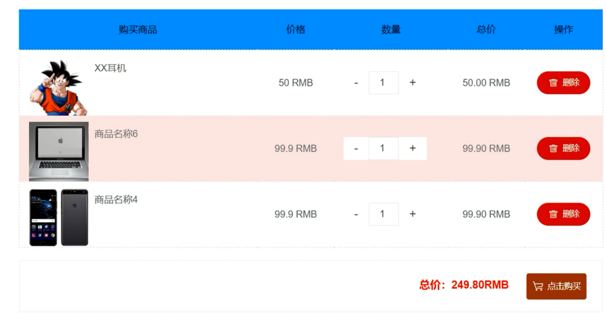

图5-6 订单信息界面【用户在订单信息界面可查看个人订单信息，订单信息界面如图】
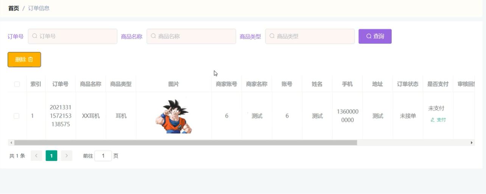

图5-7 发货订单界面【用户可查看个人发货订单信息，并可进行收货操作，发货订单界面如图】
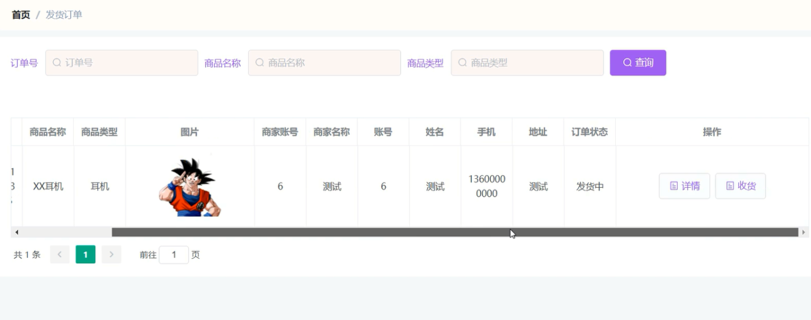

图5-8 管理员登录界面【管理员要想进入系统后台对系统进行管理，首要进入登录界面，需通过正确的账号、密码进行登录操作，管理员登录界面如图】

图5-9 商家管理界面【管理员可增删改查商家信息，商家管理界面展示如图】
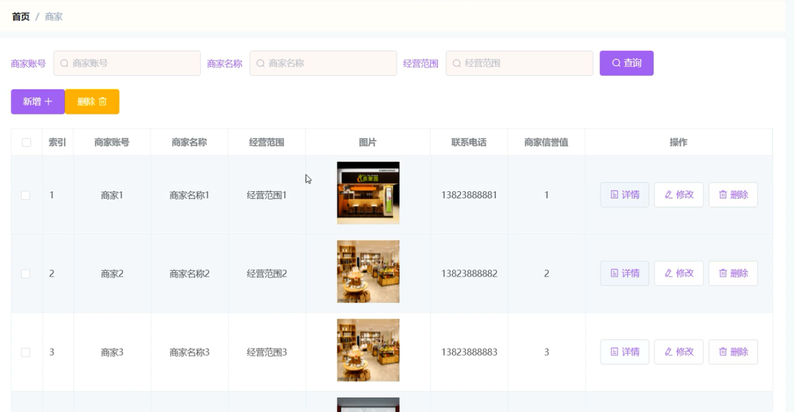

图5-10 用户管理界面【管理员可查看、修改和删除用户信息，并可新增用户，用户管理界面展示如图】
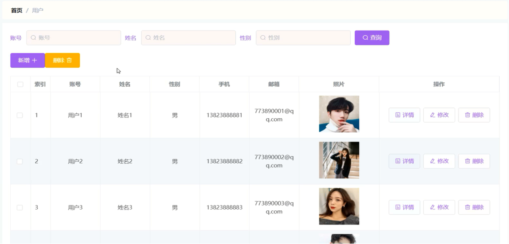

 <b>完整文章</b>

 

## 3000套系统可挑选，获取链接：https://chaerspol.github.io/

<b>QQ【获取完整源码】：674456564</b>

<b>QQ群【获取完整源码】：1058861570</b>

